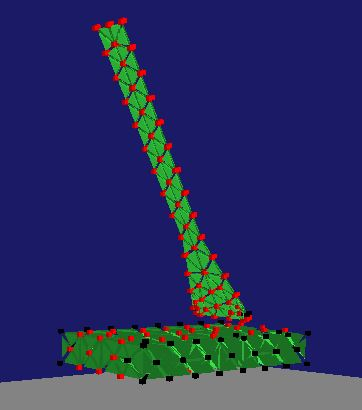

# Gecko_Adhesion_Simulation
The aim of the project was simulating the adhesion of the geckos to different surfaces in order to understand better the mechanism behind it. Specially, how the structures that form the feet of the geckos and which are known as spatula interact with a surface making use of Van der Waals forces. This knowledge is important as it could be used in the development of new adhesive materials. 

A C++ model was designed using a warped stiffness finite element approach for linear elasticity. The  model is based on the implementation done by Matthias Müller Fisher, using the same methods for elastoplastic modeling as in [1]. 

In the model the Finite Element Method (FEM) with linear displacement tetrahedra is used to solve the governing partial differential equations.

The meshes used for the finite elements calculations were imported from .txt files generated by Gmsh, a 3D mesh generator. Nevertheless, it is also possible to create simple structures using the C++ code. 

The result was a numerical model that allowed simulating the interaction of the spatulas with a surface at the same time that the computational power was not excessive; in fact it is worth noticing that it was possible to interact with the model in real-time, making use of the mouse cursor.

The project was carried out in the context of the course “Ingenia” as part of the Master´s Programme in Industrial Engineering, held in the Escuela Técnia Superior de Ingenieros Industriales de la Universidad Politécnica de Madrid (ETSII-UPM).

References:

[1] Müller, M., & Gross, M. (2004, May). Interactive virtual materials. In Proceedings of Graphics Interface 2004 (pp. 239-246). Canadian Human-Computer Communications Society.

